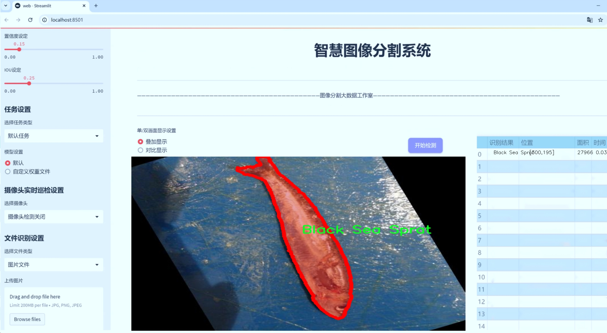
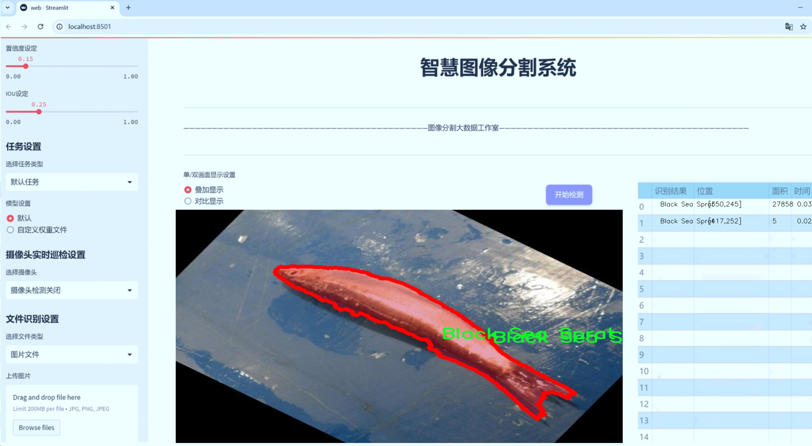
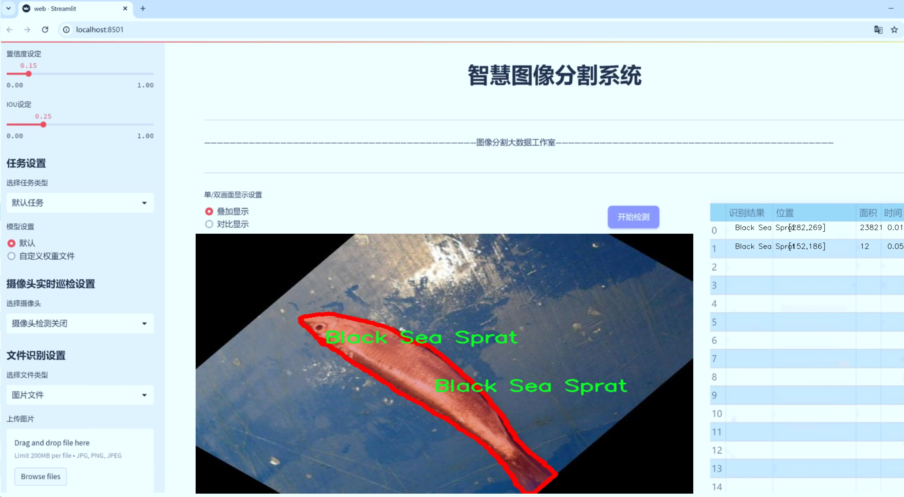
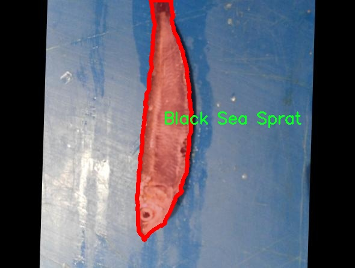
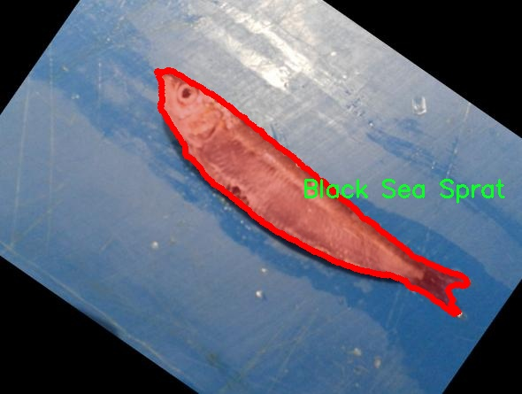
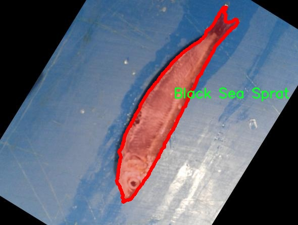
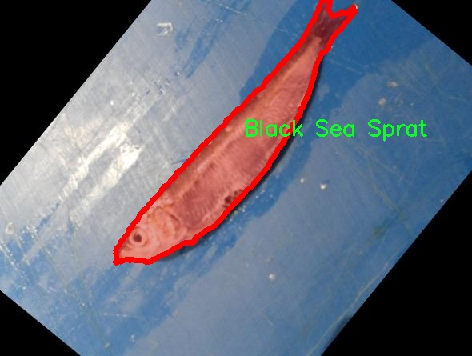
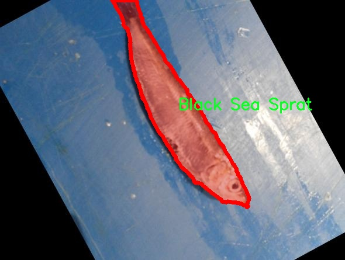

# 鱼类图像分割系统源码＆数据集分享
 [yolov8-seg-act＆yolov8-seg-dyhead-DCNV3等50+全套改进创新点发刊_一键训练教程_Web前端展示]

### 1.研究背景与意义

项目参考[ILSVRC ImageNet Large Scale Visual Recognition Challenge](https://gitee.com/YOLOv8_YOLOv11_Segmentation_Studio/projects)

项目来源[AAAI Global Al lnnovation Contest](https://kdocs.cn/l/cszuIiCKVNis)

研究背景与意义

随着全球渔业资源的不断开发与利用，鱼类的种类和数量逐渐成为生态保护和可持续发展研究的重要内容。鱼类的识别与分类不仅对渔业管理和保护具有重要意义，也为生态学、环境科学等领域提供了基础数据支持。传统的鱼类识别方法多依赖于人工观察和经验判断，效率低下且容易受到主观因素的影响。近年来，计算机视觉技术的迅猛发展为鱼类识别提供了新的解决方案，尤其是基于深度学习的图像分割技术，已成为该领域的研究热点。

YOLO（You Only Look Once）系列模型以其快速、准确的目标检测能力在计算机视觉领域取得了显著成就。YOLOv8作为该系列的最新版本，结合了多种先进的技术，进一步提升了目标检测和分割的性能。然而，针对特定领域的应用，如鱼类图像分割，仍然存在一些挑战。例如，鱼类在水中运动的复杂性、光照变化、背景干扰等因素都可能影响模型的识别精度。因此，改进YOLOv8以适应鱼类图像分割的需求，具有重要的研究价值。

本研究基于Fish_Dataset_Instance_segmentation数据集，该数据集包含6000幅图像，涵盖了六种鱼类：黑海鲱、金头鲷、红鲷、红海鲷、虾和鳟鱼。这些图像不仅数量庞大，而且种类多样，为模型的训练和验证提供了丰富的样本。通过对这些图像进行实例分割，可以有效地提取出每种鱼类的轮廓和特征，为后续的分类和分析奠定基础。数据集的多样性和丰富性使得模型在实际应用中具有更强的泛化能力。

本研究的意义在于，通过改进YOLOv8模型，提升鱼类图像分割的精度和效率，进而推动智能渔业的发展。智能渔业不仅能够提高捕捞效率，降低资源浪费，还能为生态保护提供科学依据。通过准确的鱼类识别与分类，渔业管理者可以更好地监测鱼类种群的变化，制定合理的捕捞政策，从而实现可持续发展目标。此外，鱼类图像分割技术的应用还可以拓展到水产养殖、生态监测等领域，为相关研究提供更为精准的数据支持。

综上所述，基于改进YOLOv8的鱼类图像分割系统的研究，不仅具有重要的理论价值，也具备广泛的应用前景。通过该研究，期望能够为鱼类识别与分类提供一种高效、准确的解决方案，为推动渔业的可持续发展贡献力量。同时，研究成果也将为计算机视觉领域的实例分割技术提供新的思路和方法，促进相关技术的进一步发展与应用。

### 2.图片演示







##### 注意：由于此博客编辑较早，上面“2.图片演示”和“3.视频演示”展示的系统图片或者视频可能为老版本，新版本在老版本的基础上升级如下：（实际效果以升级的新版本为准）

  （1）适配了YOLOV8的“目标检测”模型和“实例分割”模型，通过加载相应的权重（.pt）文件即可自适应加载模型。

  （2）支持“图片识别”、“视频识别”、“摄像头实时识别”三种识别模式。

  （3）支持“图片识别”、“视频识别”、“摄像头实时识别”三种识别结果保存导出，解决手动导出（容易卡顿出现爆内存）存在的问题，识别完自动保存结果并导出到tempDir中。

  （4）支持Web前端系统中的标题、背景图等自定义修改，后面提供修改教程。

  另外本项目提供训练的数据集和训练教程,暂不提供权重文件（best.pt）,需要您按照教程进行训练后实现图片演示和Web前端界面演示的效果。

### 3.视频演示

[3.1 视频演示](https://www.bilibili.com/video/BV1AryiYoEqX/)

### 4.数据集信息展示

##### 4.1 本项目数据集详细数据（类别数＆类别名）

nc: 6
names: ['Black Sea Sprat', 'Gilt-Head Bream', 'Red Mullet', 'Red Sea Bream', 'Shrimp', 'Trout']


##### 4.2 本项目数据集信息介绍

数据集信息展示

在现代计算机视觉领域，尤其是在图像分割任务中，数据集的质量和多样性对模型的性能至关重要。本研究所使用的数据集名为“Fish_Dataset_Instance_segmentation”，旨在为改进YOLOv8-seg的鱼类图像分割系统提供强有力的支持。该数据集专注于海洋生物的实例分割，涵盖了六种不同的鱼类和海洋生物，具体包括：黑海鲱（Black Sea Sprat）、金头鲷（Gilt-Head Bream）、红鲷（Red Mullet）、红海鲷（Red Sea Bream）、虾（Shrimp）和鳟鱼（Trout）。这些类别的选择不仅体现了生态多样性，还反映了在实际应用中对不同鱼类的识别需求。

“Fish_Dataset_Instance_segmentation”数据集的设计考虑到了实例分割的特定需求，确保每种鱼类在图像中都能被准确地识别和分割。数据集中包含了丰富的图像样本，每个样本都经过精心标注，确保了数据的高质量和高可靠性。通过使用这种标注方式，模型能够学习到每种鱼类的独特特征，包括形状、颜色和纹理等，从而在实际应用中实现更高的分割精度。

在数据集的构建过程中，研究团队采取了多种拍摄条件和环境设置，以确保数据的多样性。这些图像不仅来自不同的水域，还包括不同的光照条件和背景环境，使得模型在训练过程中能够适应各种复杂的场景。这种多样性不仅增强了模型的泛化能力，也为后续的实际应用提供了坚实的基础。

此外，数据集中的每一类鱼类都具备独特的生态特征。例如，黑海鲱通常在较浅的水域活动，而金头鲷则常见于较深的海域。红鲷和红海鲷在形态上有着显著的差异，而虾和鳟鱼则代表了不同的生物分类。这种生态背景的丰富性使得“Fish_Dataset_Instance_segmentation”不仅仅是一个图像数据集，更是一个研究海洋生物多样性和生态环境的重要工具。

在模型训练过程中，研究者将利用该数据集进行多轮迭代，以不断优化YOLOv8-seg的参数设置。通过分析模型在不同类别上的表现，研究团队能够识别出模型的强项和弱点，从而进行针对性的改进。这种反馈机制不仅有助于提升模型的整体性能，也为未来的研究提供了宝贵的经验。

总之，“Fish_Dataset_Instance_segmentation”数据集的构建和应用，旨在推动鱼类图像分割技术的发展。通过对六种鱼类的深入研究和实例分割，研究团队希望能够在生态监测、渔业管理和生物多样性保护等领域取得实质性进展。随着技术的不断进步和数据集的不断丰富，未来的鱼类图像分割系统将能够更好地服务于科学研究和实际应用，为海洋生态的可持续发展贡献力量。











### 5.全套项目环境部署视频教程（零基础手把手教学）

[5.1 环境部署教程链接（零基础手把手教学）](https://www.bilibili.com/video/BV1jG4Ve4E9t/?vd_source=bc9aec86d164b67a7004b996143742dc)


[5.2 安装Python虚拟环境创建和依赖库安装视频教程链接（零基础手把手教学）](https://www.bilibili.com/video/BV1nA4VeYEze/?vd_source=bc9aec86d164b67a7004b996143742dc)

### 6.手把手YOLOV8-seg训练视频教程（零基础小白有手就能学会）

[6.1 手把手YOLOV8-seg训练视频教程（零基础小白有手就能学会）](https://www.bilibili.com/video/BV1cA4VeYETe/?vd_source=bc9aec86d164b67a7004b996143742dc)


按照上面的训练视频教程链接加载项目提供的数据集，运行train.py即可开始训练



     Epoch   gpu_mem       box       obj       cls    labels  img_size
     1/200     0G   0.01576   0.01955  0.007536        22      1280: 100%|██████████| 849/849 [14:42<00:00,  1.04s/it]
               Class     Images     Labels          P          R     mAP@.5 mAP@.5:.95: 100%|██████████| 213/213 [01:14<00:00,  2.87it/s]
                 all       3395      17314      0.994      0.957      0.0957      0.0843

     Epoch   gpu_mem       box       obj       cls    labels  img_size
     2/200     0G   0.01578   0.01923  0.007006        22      1280: 100%|██████████| 849/849 [14:44<00:00,  1.04s/it]
               Class     Images     Labels          P          R     mAP@.5 mAP@.5:.95: 100%|██████████| 213/213 [01:12<00:00,  2.95it/s]
                 all       3395      17314      0.996      0.956      0.0957      0.0845

     Epoch   gpu_mem       box       obj       cls    labels  img_size
     3/200     0G   0.01561    0.0191  0.006895        27      1280: 100%|██████████| 849/849 [10:56<00:00,  1.29it/s]
               Class     Images     Labels          P          R     mAP@.5 mAP@.5:.95: 100%|███████   | 187/213 [00:52<00:00,  4.04it/s]
                 all       3395      17314      0.996      0.957      0.0957      0.0845


### 7.50+种全套YOLOV8-seg创新点代码加载调参视频教程（一键加载写好的改进模型的配置文件）

[7.1 50+种全套YOLOV8-seg创新点代码加载调参视频教程（一键加载写好的改进模型的配置文件）](https://www.bilibili.com/video/BV1Hw4VePEXv/?vd_source=bc9aec86d164b67a7004b996143742dc)

### 8.YOLOV8-seg图像分割算法原理

原始YOLOv8-seg算法原理

YOLOv8-seg作为YOLO系列的最新版本，代表了计算机视觉领域在目标检测和实例分割任务中的前沿技术。其设计理念在于兼顾检测精度与实时性，尤其是在复杂场景下对小目标的检测能力。YOLOv8-seg不仅继承了YOLO系列的高效特性，还通过一系列创新性改进，使其在精度和速度上均有显著提升。

首先，YOLOv8-seg的网络结构可分为四个主要部分：输入端、骨干网络、颈部网络和头部网络。输入端采用了马赛克数据增强、自适应锚框计算和自适应灰度填充等技术，这些技术不仅提高了模型的鲁棒性，还有效增强了输入数据的多样性。马赛克数据增强通过将多张图像拼接在一起，模拟了不同场景下的复杂背景，进而提升了模型对各种环境的适应能力。

在骨干网络部分，YOLOv8-seg引入了C2f模块和SPPF结构。C2f模块通过丰富的分支跨层连接，增强了特征的梯度流，使得模型在学习过程中能够捕捉到更为细致的特征信息。这种设计灵感来源于YOLOv7的ELAN结构，显著提升了特征表示能力。SPPF模块则通过空间金字塔池化融合不同尺度的特征，有效提升了模型对多尺度目标的检测能力。

颈部网络采用了路径聚合网络（PAN）结构，旨在加强不同缩放尺度对象的特征融合能力。PAN通过上采样和下采样的方式，将不同层次的特征图进行有效结合，确保模型在处理不同大小目标时能够充分利用上下文信息。这一设计极大地提升了YOLOv8-seg在复杂场景下的目标检测能力，尤其是在小目标的识别上。

头部网络则是YOLOv8-seg的核心部分，它将分类和检测过程进行了有效解耦。传统的耦合头结构在处理复杂任务时往往存在信息交叉干扰的问题，而YOLOv8-seg通过引入解耦头结构，分别处理分类和回归任务，从而提高了模型的整体性能。在损失计算方面，YOLOv8-seg采用了Task-Aligned Assigner策略，依据分类与回归的分数加权结果选择正样本，确保了训练过程中的样本匹配更加精准。

YOLOv8-seg的创新之处还体现在其损失函数的设计上。模型在分类分支中使用了二元交叉熵损失（BCELoss），而在回归分支中则结合了分布焦点损失（DFLoss）和完全交并比损失函数（CIOULoss）。这种组合不仅提升了模型对边界框预测的精准性，还增强了其对复杂场景下目标的感知能力。

值得一提的是，YOLOv8-seg在模型轻量化方面也做出了显著努力。通过调整不同尺度模型的通道数，精简了模型结构，同时在保持高性能的基础上，进一步降低了计算复杂度。这使得YOLOv8-seg能够在各种硬件平台上高效运行，满足实时检测的需求。

总的来说，YOLOv8-seg通过一系列创新性设计和改进，极大地提升了目标检测和实例分割的能力。其在复杂环境下的小目标检测、实时性和精度方面的表现均优于前代模型，展现了YOLO系列在计算机视觉领域的持续进步。随着YOLOv8-seg的广泛应用，未来的研究和应用将可能进一步推动目标检测技术的发展，助力于更多实际场景的智能化解决方案。


### 9.系统功能展示（检测对象为举例，实际内容以本项目数据集为准）

图9.1.系统支持检测结果表格显示

  图9.2.系统支持置信度和IOU阈值手动调节

  图9.3.系统支持自定义加载权重文件best.pt(需要你通过步骤5中训练获得)

  图9.4.系统支持摄像头实时识别

  图9.5.系统支持图片识别

  图9.6.系统支持视频识别

  图9.7.系统支持识别结果文件自动保存

  图9.8.系统支持Excel导出检测结果数据


### 10.50+种全套YOLOV8-seg创新点原理讲解（非科班也可以轻松写刊发刊，V11版本正在科研待更新）

#### 10.1 由于篇幅限制，每个创新点的具体原理讲解就不一一展开，具体见下列网址中的创新点对应子项目的技术原理博客网址【Blog】：


[10.1 50+种全套YOLOV8-seg创新点原理讲解链接](https://gitee.com/qunmasj/good)

#### 10.2 部分改进模块原理讲解(完整的改进原理见上图和技术博客链接)【如果此小节的图加载失败可以通过CSDN或者Github搜索该博客的标题访问原始博客，原始博客图片显示正常】
### YOLOv8简介
YOLOv8目标检测算法继承了YOLOv1系列的思考,是一种新型端到端的目标检测算法,尽管现在原始检测算法已经开源,但是鲜有发表的相关论文.YOLOv8的网络结构如图所示,主要可分为Input输入端、Backbone骨干神经网络、Neck 混合特征网络层和Head预测层网络共4个部分.

YOLO目标检测算法是一种端到端的One-Slage 目标检测算法，其核心思想是将图像按区域分块进行预测。YOLO将输入图像按照32x32的大小划分成若干个网格，例如416x416的图像将被划分为13x13个网格。当目标物体的中心位于某个网格内时,该网格就会负责输出该物体的边界框和类别置信度。每个网格可以预测多个边界框和多个目标类别,这些边界框和类别的数量可以根据需要进行设置。YOLO算法的输出是一个特征图,包含了每个网格对应的边界框和类别置信度的信息呵。本文采用YOLO最新的YOLOv8模型，其是2022年底发布的最新YOLO系列模型，采用全新的SOTA模型，全新的网络主干结构,如图1所示。
整个网络分为Backbone 骨干网络部分和Head头部网络部分。YOLOv8汲取了前几代网络的优秀特性，骨干网络和 Neck部分遵循CSP的思想，将YOLOv5中的C3模块被替换成了梯度流更丰富C2模块,去掉YOLOv5中 PAN-FPN上采样阶段中的卷积结构,将Backbone不同阶段输出的特征直接送入了上采样操作,模型提供了N/S/M/L/X尺度的不同大小模型,能够满足不同领域业界的需求。本文基于YOLOv8模型设计番茄病虫害检测系统，通过配置模型参数训练番茄图像,得到能够用于部署应用的最优模型。


### 感受野注意力卷积（RFAConv)
#### 标准卷积操作回顾
标准的卷积操作是构造卷积神经网络的基本构件。它利用具有共享参数的滑动窗口提取特征信息，克服了全连通层构造神经网络固有的参数多、计算开销大的问题。设 X R∈C×H×W
表示输入特征图，其中C、H、W分别表示特征图的通道数、高度、宽度。为了清楚地演示卷积核的特征提取过程，我们使用 C = 1 的例子。从每个接受域滑块中提取特征信息的卷积运算可以表示为:


这里，Fi 表示计算后每个卷积滑块得到的值，Xi 表示每个滑块内对应位置的像素值，K表示卷积核，S表示卷积核中的参数个数，N表示接收域滑块的总数。可以看出，每个滑块内相同位置的 feature共享相同的参数Ki。因此，标准的卷积运算并不能捕捉到不同位置所带来的信息差异，这最终在一定程度上限制了卷积神经网络的性能。 

#### 空间注意力回顾
目前，空间注意机制是利用学习得到的注意图来突出每个特征的重要性。与前一节类似，这里以 C=1为例。突出关键特征的空间注意机制可以简单表述为:这里，Fi 表示加权运算后得到的值。xi 和Ai 表示输入特征图和学习到的注意图在不同位置的值，N为输入特征图的高和宽的乘积，表示像素值的总数。


#### 空间注意与标准卷积运算
将注意力机制整合到卷积神经网络中，可以提高卷积神经网络的性能。通过对标准卷积运算和现有空间注意机制的研究，我们认为空间注意机制有效地克服了卷积神经网络固有的参数共享的局限性。目前卷积神经网络中最常用的核大小是 1 × 1和3 × 3。在引入空间注意机制后，提取特征的卷积操作可以是 1 × 1或3 × 3卷积操作。为了直观地展示这个过程，在 1 × 1卷积运算的前面插入了空间注意机制。通过注意图对输入特征图(Re-weight“×”)进行加权运算，最后通过 1 × 1卷积运算提取接收域的滑块特征信息。整个过程可以简单地表示如下:


 这里卷积核K仅代表一个参数值。如果取A i× ki 的值作为一种新的卷积核参数，有趣的是它解决了 1×1卷积运算提取特征时的参数共享问题。然而，关于空间注意机制的传说到此结束。当空间注意机制被插入到3×3卷积运算前面时。具体情况如下:


如上所述，如果取A的值 i × ki (4)式作为一种新的卷积核参数，完全解决了大规模卷积核的参数共享问题。然而，最重要的一点是，卷积核在提取每个接受域滑块的特征时，会共享一些特征。换句话说，每个接收域滑块内都有一个重叠。仔细分析后会发现A12= a21， a13 = a22， a15 = a24……，在这种情况下，每个滑动窗口共享空间注意力地图的权重。因此，空间注意机制没有考虑整个接受域的空间特征，不能有效地解决大规模卷积核的参数共享问题。因此，空间注意机制的有效性受到限制。 

#### 创新空间注意力和标准卷积操作
该博客提出解决了现有空间注意机制的局限性，为空间处理提供了一种创新的解决方案。受RFA的启发，一系列空间注意机制被开发出来，可以进一步提高卷积神经网络的性能。RFA可以看作是一个轻量级即插即用模块，RFA设计的卷积运算(RFAConv)可以代替标准卷积来提高卷积神经网络的性能。因此，我们预测空间注意机制与标准卷积运算的结合将继续发展，并在未来带来新的突破。
接受域空间特征:为了更好地理解接受域空间特征的概念，我们将提供相关的定义。接收域空间特征是专门为卷积核设计的，并根据核大小动态生成。如图1所示，以3×3卷积核为例。在图1中，“Spatial Feature”指的是原始的Feature map。“接受域空间特征”是空间特征变换后的特征图。

 

由不重叠的滑动窗口组成。当使用 3×3卷积内核提取特征时，接收域空间特征中的每个 3×3大小窗口代表一个接收域滑块。接受域注意卷积(RFAConv):针对接受域的空间特征，我们提出了接受域注意卷积(RFA)。该方法不仅强调了接收域滑块内不同特征的重要性，而且对接收域空间特征进行了优先排序。通过该方法，完全解决了卷积核参数共享的问题。接受域空间特征是根据卷积核的大小动态生成的，因此，RFA是卷积的固定组合，不能与卷积操作的帮助分离，卷积操作同时依赖于RFA来提高性能，因此我们提出了接受场注意卷积(RFAConv)。具有3×3大小的卷积核的RFAConv整体结构如图所示。


目前，最广泛使用的接受域特征提取方法是缓慢的。经过大量的研究，我们开发了一种快速的方法，用分组卷积来代替原来的方法。具体来说，我们利用相应大小的分组卷积来动态生成基于接受域大小的展开特征。尽管与原始的无参数方法(如PyTorch提供的nn.())相比，该方法增加了一些参数，但它的速度要快得多。注意:如前一节所述，当使用 3×3卷积内核提取特征时，接收域空间特征中的每个 3×3大小窗口表示一个接收域滑块。而利用快速分组卷积提取感受野特征后，将原始特征映射为新的特征。最近的研究表明。交互信息可以提高网络性能，如[40,41,42]所示。同样，对于RFAConv来说，通过交互接受域特征信息来学习注意图可以提高网络性能。然而，与每个接收域特征交互会导致额外的计算开销，因此为了最小化计算开销和参数的数量，我们使用AvgPool来聚合每个接收域特征的全局信息。然后，使用 1×1 组卷积操作进行信息交互。最后，我们使用softmax来强调每个特征在接受域特征中的重要性。一般情况下，RFA的计算可以表示为:


这里gi×i 表示一个大小为 i×i的分组卷积，k表示卷积核的大小，Norm表示归一化，X表示输入的特征图，F由注意图 a相乘得到 rf 与转换后的接受域空间特征 Frf。与CBAM和CA不同，RFA能够为每个接受域特征生成注意图。卷积神经网络的性能受到标准卷积操作的限制，因为卷积操作依赖于共享参数，对位置变化带来的信息差异不敏感。然而，RFAConv通过强调接收域滑块中不同特征的重要性，并对接收域空间特征进行优先级排序，可以完全解决这个问题。通过RFA得到的feature map是接受域空间特征，在“Adjust Shape”后没有重叠。因此，学习到的注意图将每个接受域滑块的特征信息聚合起来。换句话说，注意力地图不再共享在每个接受域滑块。这完全弥补了现有 CA和CBAM注意机制的不足。RFA为标准卷积内核提供了显著的好处。而在调整形状后，特征的高度和宽度是 k倍，需要进行 stride = k的k × k卷积运算来提取特征信息。RFA设计的卷积运算RFAConv为卷积带来了良好的增益，对标准卷积进行了创新。
此外，我们认为现有的空间注意机制应该优先考虑接受域空间特征，以提高网络性能。众所周知，基于自注意机制的网络模型[43,44,45]取得了很大的成功，因为它解决了卷积参数共享的问题，并对远程信息进行建模。然而，自注意机制也为模型引入了显著的计算开销和复杂性。我们认为，将现有的空间注意机制的注意力引导到接受场空间特征上，可以以类似于自我注意的方式解决长期信息的参数共享和建模问题。与自我关注相比，这种方法需要的参数和计算资源少得多。答案如下:(1)将以接收场空间特征为中心的空间注意机制与卷积相结合，消除了卷积参数共享的问题。(2)现有的空间注意机制已经考虑了远程信息，可以通过全局平均池或全局最大池的方式获取全局信息，其中明确考虑了远程信息。因此，我们设计了新的 CBAM和CA模型，称为RFCBAM和RFCA，它们专注于接受域空间特征。与RFA类似，使用最终的k × k stride = k 的卷积运算来提取特征信息。这两种新的卷积方法的具体结构如图 3所示，我们称这两种新的卷积操作为 RFCBAMConv和RFCAConv。与原来的CBAM相比，我们在RFCBAM中使用SE attention来代替CAM。因为这样可以减少计算开销。此外，在RFCBAM中，通道注意和空间注意不是分开执行的。相反，它们是同时加权的，使得每个通道获得的注意力地图是不同的。


### 11.项目核心源码讲解（再也不用担心看不懂代码逻辑）

#### 11.1 ultralytics\models\sam\amg.py

以下是代码中最核心的部分，并附上详细的中文注释：

```python
import torch
import numpy as np
from itertools import product
import math

def is_box_near_crop_edge(boxes: torch.Tensor,
                          crop_box: List[int],
                          orig_box: List[int],
                          atol: float = 20.0) -> torch.Tensor:
    """
    判断给定的边界框是否接近裁剪边缘。

    参数:
    boxes: 要检查的边界框，格式为 (x1, y1, x2, y2) 的张量。
    crop_box: 当前裁剪框的边界 [x0, y0, x1, y1]。
    orig_box: 原始图像的边界框 [x0, y0, x1, y1]。
    atol: 允许的绝对误差，默认为 20.0。

    返回:
    一个布尔张量，指示每个边界框是否接近裁剪边缘。
    """
    crop_box_torch = torch.as_tensor(crop_box, dtype=torch.float, device=boxes.device)
    orig_box_torch = torch.as_tensor(orig_box, dtype=torch.float, device=boxes.device)
    boxes = uncrop_boxes_xyxy(boxes, crop_box).float()  # 将边界框转换为原始坐标系
    near_crop_edge = torch.isclose(boxes, crop_box_torch[None, :], atol=atol, rtol=0)  # 检查是否接近裁剪框
    near_image_edge = torch.isclose(boxes, orig_box_torch[None, :], atol=atol, rtol=0)  # 检查是否接近原始图像边缘
    near_crop_edge = torch.logical_and(near_crop_edge, ~near_image_edge)  # 只保留接近裁剪框而不接近原始图像边缘的框
    return torch.any(near_crop_edge, dim=1)  # 返回每个框是否接近裁剪边缘的布尔值

def uncrop_boxes_xyxy(boxes: torch.Tensor, crop_box: List[int]) -> torch.Tensor:
    """
    将边界框从裁剪坐标系转换回原始坐标系。

    参数:
    boxes: 要转换的边界框，格式为 (x1, y1, x2, y2) 的张量。
    crop_box: 当前裁剪框的边界 [x0, y0, x1, y1]。

    返回:
    转换后的边界框张量。
    """
    x0, y0, _, _ = crop_box
    offset = torch.tensor([[x0, y0, x0, y0]], device=boxes.device)  # 计算偏移量
    if len(boxes.shape) == 3:  # 检查是否有通道维度
        offset = offset.unsqueeze(1)
    return boxes + offset  # 将偏移量加到边界框上

def generate_crop_boxes(im_size: Tuple[int, ...], n_layers: int,
                        overlap_ratio: float) -> Tuple[List[List[int]], List[int]]:
    """
    生成不同大小的裁剪框列表。

    参数:
    im_size: 图像的尺寸 (高度, 宽度)。
    n_layers: 裁剪层数。
    overlap_ratio: 重叠比例。

    返回:
    裁剪框列表和对应的层索引列表。
    """
    crop_boxes, layer_idxs = [], []
    im_h, im_w = im_size
    short_side = min(im_h, im_w)

    # 添加原始图像的裁剪框
    crop_boxes.append([0, 0, im_w, im_h])
    layer_idxs.append(0)

    def crop_len(orig_len, n_crops, overlap):
        """计算裁剪框的长度。"""
        return int(math.ceil((overlap * (n_crops - 1) + orig_len) / n_crops))

    for i_layer in range(n_layers):
        n_crops_per_side = 2 ** (i_layer + 1)  # 每层的裁剪框数量
        overlap = int(overlap_ratio * short_side * (2 / n_crops_per_side))  # 计算重叠长度

        crop_w = crop_len(im_w, n_crops_per_side, overlap)  # 计算裁剪框宽度
        crop_h = crop_len(im_h, n_crops_per_side, overlap)  # 计算裁剪框高度

        crop_box_x0 = [int((crop_w - overlap) * i) for i in range(n_crops_per_side)]
        crop_box_y0 = [int((crop_h - overlap) * i) for i in range(n_crops_per_side)]

        # 生成裁剪框的 XYWH 格式
        for x0, y0 in product(crop_box_x0, crop_box_y0):
            box = [x0, y0, min(x0 + crop_w, im_w), min(y0 + crop_h, im_h)]
            crop_boxes.append(box)
            layer_idxs.append(i_layer + 1)

    return crop_boxes, layer_idxs  # 返回裁剪框和层索引

def batched_mask_to_box(masks: torch.Tensor) -> torch.Tensor:
    """
    计算掩膜周围的边界框，格式为 XYXY。

    参数:
    masks: 输入掩膜，形状为 C1xC2x...xHxW。

    返回:
    形状为 C1xC2x...x4 的边界框张量。
    """
    if torch.numel(masks) == 0:  # 如果掩膜为空，返回 [0, 0, 0, 0]
        return torch.zeros(*masks.shape[:-2], 4, device=masks.device)

    shape = masks.shape
    h, w = shape[-2:]  # 获取掩膜的高度和宽度
    masks = masks.flatten(0, -3) if len(shape) > 2 else masks.unsqueeze(0)  # 规范化形状为 CxHxW

    # 获取上边缘和下边缘
    in_height, _ = torch.max(masks, dim=-1)
    in_height_coords = in_height * torch.arange(h, device=in_height.device)[None, :]
    bottom_edges, _ = torch.max(in_height_coords, dim=-1)
    in_height_coords = in_height_coords + h * (~in_height)
    top_edges, _ = torch.min(in_height_coords, dim=-1)

    # 获取左边缘和右边缘
    in_width, _ = torch.max(masks, dim=-2)
    in_width_coords = in_width * torch.arange(w, device=in_width.device)[None, :]
    right_edges, _ = torch.max(in_width_coords, dim=-1)
    in_width_coords = in_width_coords + w * (~in_width)
    left_edges, _ = torch.min(in_width_coords, dim=-1)

    # 如果掩膜为空，右边缘会在左边缘的左侧，替换这些框为 [0, 0, 0, 0]
    empty_filter = (right_edges < left_edges) | (bottom_edges < top_edges)
    out = torch.stack([left_edges, top_edges, right_edges, bottom_edges], dim=-1)
    out = out * (~empty_filter).unsqueeze(-1)

    return out.reshape(*shape[:-2], 4) if len(shape) > 2 else out[0]  # 返回到原始形状
```

### 核心功能概述：
1. **边界框处理**：包括判断边界框是否接近裁剪边缘、将裁剪框转换回原始坐标系、以及根据掩膜计算边界框。
2. **裁剪框生成**：根据图像尺寸和层数生成不同大小的裁剪框，支持重叠。
3. **掩膜与边界框的转换**：将掩膜转换为边界框，处理空掩膜的情况。 

这些功能在目标检测和图像处理任务中非常重要，尤其是在使用YOLO等模型时。

该文件 `amg.py` 是 Ultralytics YOLO 项目的一部分，主要涉及图像处理和目标检测中的一些实用功能。文件中包含多个函数，以下是对这些函数的逐一分析和说明。

首先，`is_box_near_crop_edge` 函数用于判断给定的边界框是否接近裁剪边缘。它接收三个参数：边界框、裁剪框和原始框。通过将边界框转换为浮点张量，并与裁剪框和原始框进行比较，函数返回一个布尔张量，指示哪些边界框接近裁剪边缘。

接下来，`batch_iterator` 函数用于从输入参数中生成批次数据。它确保所有输入的长度相同，并通过生成器的方式逐批返回数据。这对于处理大规模数据集时非常有用，可以有效地管理内存。

`calculate_stability_score` 函数计算一组掩膜的稳定性分数。该分数是通过计算高低阈值下的二进制掩膜之间的交并比（IoU）来得出的。这对于评估掩膜的可靠性和一致性非常重要。

`build_point_grid` 函数生成一个二维网格，网格中的点均匀分布在 [0,1] x [0,1] 的范围内。该函数在目标检测中可能用于生成候选框的中心点。

`build_all_layer_point_grids` 函数为所有裁剪层生成点网格。它调用 `build_point_grid` 函数，并根据层数和每层的缩放比例生成不同大小的点网格。

`generate_crop_boxes` 函数生成不同大小的裁剪框列表。它根据输入图像的大小、层数和重叠比例计算裁剪框的位置和大小，并返回裁剪框及其对应的层索引。

`uncrop_boxes_xyxy` 和 `uncrop_points` 函数用于将裁剪框和点的坐标转换回原始图像坐标。这些函数通过添加裁剪框的偏移量来实现坐标的逆变换。

`uncrop_masks` 函数将掩膜从裁剪区域还原到原始图像大小。它通过填充操作将掩膜扩展到原始图像的尺寸，确保掩膜的完整性。

`remove_small_regions` 函数用于去除掩膜中的小区域或孔洞。它使用 OpenCV 的连通组件分析方法，返回修改后的掩膜和一个指示是否进行了修改的布尔值。

`batched_mask_to_box` 函数计算掩膜周围的边界框。它支持多维掩膜输入，并返回相应的边界框坐标。如果掩膜为空，则返回 [0, 0, 0, 0]。

总体而言，这个文件提供了一系列用于图像裁剪、掩膜处理和边界框计算的工具函数，旨在支持目标检测和图像分割任务。通过这些函数，用户可以更方便地处理图像数据，进行目标检测和分析。

#### 11.2 ui.py

以下是代码中最核心的部分，并附上详细的中文注释：

```python
import sys
import subprocess

def run_script(script_path):
    """
    使用当前 Python 环境运行指定的脚本。

    Args:
        script_path (str): 要运行的脚本路径

    Returns:
        None
    """
    # 获取当前 Python 解释器的路径
    python_path = sys.executable

    # 构建运行命令，使用 streamlit 运行指定的脚本
    command = f'"{python_path}" -m streamlit run "{script_path}"'

    # 执行命令
    result = subprocess.run(command, shell=True)
    # 检查命令执行的返回码，如果不为0，表示执行出错
    if result.returncode != 0:
        print("脚本运行出错。")

# 实例化并运行应用
if __name__ == "__main__":
    # 指定要运行的脚本路径
    script_path = "web.py"  # 这里可以直接指定脚本路径

    # 调用函数运行脚本
    run_script(script_path)
```

### 代码说明：
1. **导入模块**：
   - `sys`：用于访问与 Python 解释器相关的变量和函数。
   - `subprocess`：用于执行外部命令和程序。

2. **`run_script` 函数**：
   - 该函数接收一个脚本路径作为参数，并使用当前 Python 环境来运行该脚本。
   - `sys.executable` 获取当前 Python 解释器的路径，以确保使用正确的 Python 环境。
   - 构建命令字符串，使用 `streamlit` 模块来运行指定的脚本。
   - 使用 `subprocess.run` 执行命令，并检查返回码以判断脚本是否成功运行。

3. **主程序块**：
   - 当脚本作为主程序运行时，指定要运行的脚本路径（这里是 `web.py`）。
   - 调用 `run_script` 函数来执行指定的脚本。

这个程序文件的主要功能是使用当前的 Python 环境来运行一个指定的脚本，具体来说是一个名为 `web.py` 的脚本。程序首先导入了必要的模块，包括 `sys`、`os` 和 `subprocess`，以及一个自定义的 `abs_path` 函数，用于获取文件的绝对路径。

在 `run_script` 函数中，首先获取当前 Python 解释器的路径，这样可以确保使用正确的 Python 环境来执行脚本。接着，构建一个命令字符串，该命令使用 `streamlit` 模块来运行指定的脚本。`streamlit` 是一个用于构建数据应用的流行库。

随后，使用 `subprocess.run` 方法来执行构建好的命令。这个方法会在一个新的进程中运行命令，并等待其完成。如果命令执行的返回码不为零，表示脚本运行出错，程序会打印出错误信息。

在文件的最后部分，使用 `if __name__ == "__main__":` 语句来确保只有在直接运行该文件时才会执行下面的代码。这里指定了要运行的脚本路径 `web.py`，并调用 `run_script` 函数来执行它。

总体来说，这个程序的作用是提供一个简单的接口，通过当前的 Python 环境来运行一个 Streamlit 应用脚本，便于开发和测试。

#### 11.3 ultralytics\data\converter.py

以下是代码中最核心的部分，并附上详细的中文注释：

```python
def coco91_to_coco80_class():
    """
    将COCO数据集中91个类别的ID转换为80个类别的ID。

    返回:
        (list): 一个长度为91的列表，其中索引表示80个类别的ID，值为对应的91个类别的ID。
    """
    return [
        0, 1, 2, 3, 4, 5, 6, 7, 8, 9, 10, None, 11, 12, 13, 14, 15, 16, 17, 18, 19, 20, 21, 22, 23, None, 24, 25, None,
        None, 26, 27, 28, 29, 30, 31, 32, 33, 34, 35, 36, 37, 38, 39, None, 40, 41, 42, 43, 44, 45, 46, 47, 48, 49, 50,
        51, 52, 53, 54, 55, 56, 57, 58, 59, None, 60, None, None, 61, None, 62, 63, 64, 65, 66, 67, 68, 69, 70, 71, 72,
        None, 73, 74, 75, 76, 77, 78, 79, None]


def convert_coco(labels_dir='../coco/annotations/',
                 save_dir='coco_converted/',
                 use_segments=False,
                 use_keypoints=False,
                 cls91to80=True):
    """
    将COCO数据集的标注转换为YOLO格式，以便训练YOLO模型。

    参数:
        labels_dir (str, optional): COCO数据集标注文件的目录路径。
        save_dir (str, optional): 保存结果的目录路径。
        use_segments (bool, optional): 是否在输出中包含分割掩码。
        use_keypoints (bool, optional): 是否在输出中包含关键点标注。
        cls91to80 (bool, optional): 是否将91个COCO类别ID映射到对应的80个COCO类别ID。

    输出:
        在指定的输出目录生成结果文件。
    """

    # 创建数据集目录
    save_dir = increment_path(save_dir)  # 如果保存目录已存在，则递增命名
    for p in save_dir / 'labels', save_dir / 'images':
        p.mkdir(parents=True, exist_ok=True)  # 创建目录

    # 转换类别
    coco80 = coco91_to_coco80_class()

    # 导入json文件
    for json_file in sorted(Path(labels_dir).resolve().glob('*.json')):
        fn = Path(save_dir) / 'labels' / json_file.stem.replace('instances_', '')  # 文件夹名称
        fn.mkdir(parents=True, exist_ok=True)
        with open(json_file) as f:
            data = json.load(f)

        # 创建图像字典
        images = {f'{x["id"]:d}': x for x in data['images']}
        # 创建图像-标注字典
        imgToAnns = defaultdict(list)
        for ann in data['annotations']:
            imgToAnns[ann['image_id']].append(ann)

        # 写入标注文件
        for img_id, anns in TQDM(imgToAnns.items(), desc=f'Annotations {json_file}'):
            img = images[f'{img_id:d}']
            h, w, f = img['height'], img['width'], img['file_name']

            bboxes = []  # 存储边界框
            segments = []  # 存储分割
            keypoints = []  # 存储关键点
            for ann in anns:
                if ann['iscrowd']:
                    continue  # 跳过人群标注
                # COCO框格式为 [左上角x, 左上角y, 宽度, 高度]
                box = np.array(ann['bbox'], dtype=np.float64)
                box[:2] += box[2:] / 2  # 将左上角坐标转换为中心坐标
                box[[0, 2]] /= w  # 归一化x坐标
                box[[1, 3]] /= h  # 归一化y坐标
                if box[2] <= 0 or box[3] <= 0:  # 如果宽度或高度小于等于0
                    continue

                cls = coco80[ann['category_id'] - 1] if cls91to80 else ann['category_id'] - 1  # 类别
                box = [cls] + box.tolist()  # 将类别和边界框合并
                if box not in bboxes:
                    bboxes.append(box)  # 添加边界框
                if use_segments and ann.get('segmentation') is not None:
                    # 处理分割
                    if len(ann['segmentation']) == 0:
                        segments.append([])
                        continue
                    elif len(ann['segmentation']) > 1:
                        s = merge_multi_segment(ann['segmentation'])  # 合并多个分割
                        s = (np.concatenate(s, axis=0) / np.array([w, h])).reshape(-1).tolist()
                    else:
                        s = [j for i in ann['segmentation'] for j in i]  # 所有分割连接
                        s = (np.array(s).reshape(-1, 2) / np.array([w, h])).reshape(-1).tolist()
                    s = [cls] + s
                    if s not in segments:
                        segments.append(s)  # 添加分割
                if use_keypoints and ann.get('keypoints') is not None:
                    keypoints.append(box + (np.array(ann['keypoints']).reshape(-1, 3) /
                                            np.array([w, h, 1])).reshape(-1).tolist())

            # 写入文件
            with open((fn / f).with_suffix('.txt'), 'a') as file:
                for i in range(len(bboxes)):
                    if use_keypoints:
                        line = *(keypoints[i]),  # 类别, 边界框, 关键点
                    else:
                        line = *(segments[i]
                                 if use_segments and len(segments[i]) > 0 else bboxes[i]),  # 类别, 边界框或分割
                    file.write(('%g ' * len(line)).rstrip() % line + '\n')

    LOGGER.info(f'COCO数据成功转换。\n结果保存到 {save_dir.resolve()}')
```

### 代码核心部分说明：
1. **类别转换函数**：`coco91_to_coco80_class` 用于将91个类别的ID转换为80个类别的ID，返回一个映射列表。
2. **转换函数**：`convert_coco` 是主要的转换函数，它将COCO格式的标注转换为YOLO格式，支持分割和关键点的选择性输出。
3. **数据处理**：在处理每个图像的标注时，代码会根据需要进行归一化处理，并将类别、边界框、分割和关键点信息整理到对应的列表中。
4. **文件写入**：最终将处理后的数据写入到指定的文本文件中，格式符合YOLO的要求。

这个程序文件 `ultralytics\data\converter.py` 主要用于将 COCO 数据集的标注格式转换为 YOLO 模型所需的标注格式。程序中定义了多个函数，具体功能如下：

首先，文件导入了一些必要的库，包括 `json`、`defaultdict`、`Path`、`cv2` 和 `numpy`，并引入了 `LOGGER` 和 `TQDM` 用于日志记录和进度条显示。

`coco91_to_coco80_class` 函数将 COCO 数据集中 91 个类别的 ID 转换为 80 个类别的 ID，并返回一个列表，其中列表的索引代表 80 类别的 ID，值为对应的 91 类别的 ID。相对的，`coco80_to_coco91_class` 函数则实现了从 80 类别 ID 到 91 类别 ID 的转换。

`convert_coco` 函数是该文件的核心功能，用于将 COCO 数据集的标注文件转换为 YOLO 格式。该函数接受多个参数，包括标注文件的目录、保存结果的目录、是否使用分割掩码、是否使用关键点标注以及是否将 91 类别 ID 转换为 80 类别 ID。函数首先创建保存结果的目录，并确保目录结构正确。接着，读取指定目录下的 JSON 文件，解析图像和标注信息，并将其转换为 YOLO 格式的标注文件。

在转换过程中，程序会根据图像的宽高和标注框的坐标进行归一化处理，并将类别 ID 转换为相应的格式。程序还支持将分割掩码和关键点信息写入输出文件，具体取决于用户的设置。

`convert_dota_to_yolo_obb` 函数用于将 DOTA 数据集的标注转换为 YOLO 的有向边界框格式。该函数处理 DOTA 数据集中的训练和验证图像，读取原始标签并将其转换为 YOLO 格式，保存到新的目录中。函数内部定义了一个 `convert_label` 辅助函数，用于处理单个图像的标注转换。

此外，程序还定义了 `min_index` 函数，用于查找两个二维点数组之间距离最短的点对索引，以及 `merge_multi_segment` 函数，用于合并多个分割段，将其连接成一个列表。

总体而言，这个程序文件提供了 COCO 和 DOTA 数据集标注格式转换的功能，便于用户将数据集准备为 YOLO 模型训练所需的格式。

#### 11.4 ultralytics\nn\modules\block.py

以下是经过简化和注释的核心代码部分，主要保留了YOLO模型中的重要模块和功能：

```python
import torch
import torch.nn as nn
import torch.nn.functional as F

class DFL(nn.Module):
    """
    分布焦点损失（DFL）模块，主要用于目标检测中的损失计算。
    """

    def __init__(self, c1=16):
        """初始化DFL模块，创建一个卷积层。"""
        super().__init__()
        # 创建一个卷积层，将输入通道数从c1压缩到1
        self.conv = nn.Conv2d(c1, 1, 1, bias=False).requires_grad_(False)
        # 初始化卷积层的权重为[0, 1, ..., c1-1]
        x = torch.arange(c1, dtype=torch.float)
        self.conv.weight.data[:] = nn.Parameter(x.view(1, c1, 1, 1))
        self.c1 = c1

    def forward(self, x):
        """前向传播，计算输出。"""
        b, c, a = x.shape  # b: batch size, c: channels, a: anchors
        # 通过卷积层处理输入并返回结果
        return self.conv(x.view(b, 4, self.c1, a).transpose(2, 1).softmax(1)).view(b, 4, a)


class Proto(nn.Module):
    """YOLOv8掩膜原型模块，用于分割模型。"""

    def __init__(self, c1, c_=256, c2=32):
        """初始化Proto模块，设置输入通道和输出通道。"""
        super().__init__()
        self.cv1 = Conv(c1, c_, k=3)  # 第一个卷积层
        self.upsample = nn.ConvTranspose2d(c_, c_, 2, 2, 0, bias=True)  # 上采样层
        self.cv2 = Conv(c_, c_, k=3)  # 第二个卷积层
        self.cv3 = Conv(c_, c2)  # 第三个卷积层

    def forward(self, x):
        """前向传播，经过多个卷积和上采样层。"""
        return self.cv3(self.cv2(self.upsample(self.cv1(x))))


class HGStem(nn.Module):
    """
    PPHGNetV2的StemBlock，包含多个卷积和最大池化层。
    """

    def __init__(self, c1, cm, c2):
        """初始化StemBlock，设置输入输出通道。"""
        super().__init__()
        self.stem1 = Conv(c1, cm, 3, 2)  # 第一个卷积层
        self.stem2a = Conv(cm, cm // 2, 2, 1, 0)  # 第二个卷积层
        self.stem2b = Conv(cm // 2, cm, 2, 1, 0)  # 第三个卷积层
        self.stem3 = Conv(cm * 2, cm, 3, 2)  # 第四个卷积层
        self.stem4 = Conv(cm, c2, 1, 1)  # 第五个卷积层
        self.pool = nn.MaxPool2d(kernel_size=2, stride=1, padding=0, ceil_mode=True)  # 最大池化层

    def forward(self, x):
        """前向传播，处理输入数据。"""
        x = self.stem1(x)
        x = F.pad(x, [0, 1, 0, 1])  # 填充
        x2 = self.stem2a(x)
        x2 = F.pad(x2, [0, 1, 0, 1])  # 填充
        x2 = self.stem2b(x2)
        x1 = self.pool(x)  # 最大池化
        x = torch.cat([x1, x2], dim=1)  # 拼接
        x = self.stem3(x)
        x = self.stem4(x)
        return x


class C3(nn.Module):
    """CSP Bottleneck模块，包含3个卷积层。"""

    def __init__(self, c1, c2, n=1, shortcut=True, g=1, e=0.5):
        """初始化C3模块，设置输入输出通道和其他参数。"""
        super().__init__()
        c_ = int(c2 * e)  # 隐藏通道数
        self.cv1 = Conv(c1, c_, 1, 1)  # 第一个卷积层
        self.cv2 = Conv(c1, c_, 1, 1)  # 第二个卷积层
        self.cv3 = Conv(2 * c_, c2, 1)  # 第三个卷积层
        self.m = nn.Sequential(*(Bottleneck(c_, c_, shortcut, g, k=((1, 1), (3, 3)), e=1.0) for _ in range(n)))  # Bottleneck序列

    def forward(self, x):
        """前向传播，计算输出。"""
        return self.cv3(torch.cat((self.m(self.cv1(x)), self.cv2(x)), 1))  # 拼接后通过第三个卷积层


class Bottleneck(nn.Module):
    """标准的Bottleneck模块。"""

    def __init__(self, c1, c2, shortcut=True, g=1, k=(3, 3), e=0.5):
        """初始化Bottleneck模块，设置输入输出通道和其他参数。"""
        super().__init__()
        c_ = int(c2 * e)  # 隐藏通道数
        self.cv1 = Conv(c1, c_, k[0], 1)  # 第一个卷积层
        self.cv2 = Conv(c_, c2, k[1], 1, g=g)  # 第二个卷积层
        self.add = shortcut and c1 == c2  # 是否使用shortcut连接

    def forward(self, x):
        """前向传播，计算输出。"""
        return x + self.cv2(self.cv1(x)) if self.add else self.cv2(self.cv1(x))  # 根据是否使用shortcut决定输出
```

### 代码注释说明：
1. **DFL模块**：实现了分布焦点损失的计算，主要用于目标检测中的损失函数。
2. **Proto模块**：用于YOLOv8的掩膜原型，处理分割任务。
3. **HGStem模块**：构建了PPHGNetV2的StemBlock，包含多个卷积和池化操作。
4. **C3模块**：实现了CSP Bottleneck结构，包含多个卷积层和shortcut连接。
5. **Bottleneck模块**：标准的Bottleneck结构，包含两个卷积层和可选的shortcut连接。

以上代码为YOLO模型的核心模块，具有重要的结构和功能。

这个程序文件 `ultralytics/nn/modules/block.py` 是一个实现了多种神经网络模块的 Python 文件，主要用于构建 YOLO（You Only Look Once）系列模型，特别是 YOLOv8。文件中使用了 PyTorch 框架，包含了多个类，每个类代表一个特定的网络模块。

首先，文件导入了必要的库，包括 `torch` 和 `torch.nn`，并从其他模块导入了一些卷积和变换相关的类。文件中定义的模块包括 DFL（Distribution Focal Loss）、Proto、HGStem、HGBlock、SPP（Spatial Pyramid Pooling）、CSP Bottleneck 等。这些模块在构建 YOLO 模型时用于特征提取和处理。

DFL 类实现了分布焦点损失的核心模块，初始化时创建了一个卷积层，并将权重设置为输入通道的范围。其前向传播方法对输入张量进行处理，返回经过卷积和 softmax 处理后的结果。

Proto 类是 YOLOv8 中用于分割模型的掩码原型模块。它通过多个卷积层和上采样层来处理输入，生成分割所需的特征图。

HGStem 类实现了 PPHGNetV2 的 StemBlock，包含多个卷积层和一个最大池化层。其前向传播方法依次通过这些层处理输入，并进行特征的拼接。

HGBlock 类是 PPHGNetV2 的一个模块，使用了轻量级卷积（LightConv）或标准卷积，构建了一个包含多个卷积层的网络块。它支持快捷连接，允许输入直接与输出相加。

SPP 和 SPPF 类实现了空间金字塔池化层，分别是标准和快速版本。它们通过不同大小的池化操作来提取多尺度特征，增强模型对不同输入尺寸的适应能力。

C1、C2、C2f、C3、C3x、RepC3、C3TR 和 C3Ghost 类实现了不同类型的 CSP Bottleneck 模块。这些模块通过卷积和跳跃连接来构建深层网络，支持多种配置，如卷积数量、是否使用快捷连接等。它们的设计旨在提高网络的表现力和计算效率。

GhostBottleneck 类实现了 GhostNet 的瓶颈结构，通过使用 Ghost 卷积和深度可分离卷积来减少计算量，同时保持特征提取能力。

Bottleneck 和 BottleneckCSP 类实现了标准的瓶颈结构和 CSP 瓶颈结构，前者使用了两个卷积层，后者则在结构上引入了跨阶段部分连接，以提高信息流动。

总体而言，这个文件定义了 YOLO 模型中多个重要的构建模块，采用了现代深度学习中常用的设计模式，如瓶颈结构、空间金字塔池化等，旨在提升模型的性能和效率。

#### 11.5 ultralytics\engine\__init__.py

以下是代码的核心部分，并附上详细的中文注释：

```python
# Ultralytics YOLO 🚀, AGPL-3.0 license

# 这是一个YOLO（You Only Look Once）目标检测模型的实现代码，使用了Ultralytics的YOLO版本。
# YOLO是一种实时目标检测系统，能够在单个前向传播中同时进行目标分类和定位。

# 该代码遵循AGPL-3.0许可证，意味着任何使用该代码的项目都必须公开其源代码。

# 核心功能包括：
# 1. 加载模型
# 2. 进行目标检测
# 3. 输出检测结果

# 下面是一个伪代码示例，展示如何使用YOLO模型进行目标检测：

# 导入必要的库
import torch  # 导入PyTorch库，用于深度学习模型的构建和训练

# 加载YOLO模型
model = torch.hub.load('ultralytics/yolov5', 'yolov5s', pretrained=True)  # 加载预训练的YOLOv5s模型

# 读取输入图像
img = 'path/to/image.jpg'  # 指定要检测的图像路径

# 进行目标检测
results = model(img)  # 使用模型对图像进行推理，返回检测结果

# 输出检测结果
results.print()  # 打印检测结果，包括检测到的目标类别和置信度
results.show()   # 显示带有检测框的图像
results.save()   # 保存检测结果图像
```

### 注释说明：
1. **导入库**：导入PyTorch库以便使用深度学习功能。
2. **加载模型**：通过`torch.hub.load`方法加载预训练的YOLOv5s模型，方便进行目标检测。
3. **读取图像**：指定待检测的图像路径。
4. **目标检测**：调用模型对图像进行推理，获取检测结果。
5. **输出结果**：打印、显示和保存检测结果，方便用户查看检测效果。

以上是YOLO目标检测的核心代码及其详细注释。

这个程序文件的文件名是 `ultralytics\engine\__init__.py`，它是 Ultralytics YOLO 项目的一部分。根据文件中的注释，这个项目是基于 AGPL-3.0 许可证发布的，意味着它是一个开源项目，允许用户自由使用、修改和分发，但要求任何衍生作品也必须在相同的许可证下发布。

在 Python 中，`__init__.py` 文件通常用于标识一个目录是一个包，并且可以包含包的初始化代码。虽然在你提供的代码片段中只有一行注释，但通常这个文件可能会包含其他功能，比如导入模块、定义包的公共接口或初始化一些必要的设置。

Ultralytics YOLO 是一个流行的目标检测框架，基于 YOLO（You Only Look Once）算法，旨在提供高效、准确的目标检测能力。该项目可能包含多个模块和功能，`__init__.py` 文件的存在使得用户可以方便地导入和使用这些功能。

总的来说，这个文件是 Ultralytics YOLO 项目的一部分，主要用于包的初始化，虽然当前代码片段非常简单，但它可能是更复杂代码结构的一部分。

#### 11.6 train.py

以下是经过简化并添加详细中文注释的核心代码部分：

```python
import os
import torch
import yaml
from ultralytics import YOLO  # 导入YOLO模型

if __name__ == '__main__':  # 确保该模块被直接运行时才执行以下代码
    # 设置训练参数
    workers = 1  # 数据加载的工作进程数
    batch = 8  # 每个批次的样本数量
    device = "0" if torch.cuda.is_available() else "cpu"  # 判断是否使用GPU

    # 获取数据集的YAML配置文件的绝对路径
    data_path = abs_path(f'datasets/data/data.yaml', path_type='current')  

    # 将路径格式转换为Unix风格
    unix_style_path = data_path.replace(os.sep, '/')
    # 获取数据集所在目录的路径
    directory_path = os.path.dirname(unix_style_path)

    # 读取YAML文件，保持原有顺序
    with open(data_path, 'r') as file:
        data = yaml.load(file, Loader=yaml.FullLoader)

    # 修改数据集中训练、验证和测试集的路径
    if 'train' in data and 'val' in data and 'test' in data:
        data['train'] = directory_path + '/train'  # 设置训练集路径
        data['val'] = directory_path + '/val'      # 设置验证集路径
        data['test'] = directory_path + '/test'    # 设置测试集路径

        # 将修改后的数据写回YAML文件
        with open(data_path, 'w') as file:
            yaml.safe_dump(data, file, sort_keys=False)

    # 加载YOLO模型配置文件和预训练权重
    model = YOLO(r"C:\codeseg\codenew\50+种YOLOv8算法改进源码大全和调试加载训练教程（非必要）\改进YOLOv8模型配置文件\yolov8-seg-C2f-Faster.yaml").load("./weights/yolov8s-seg.pt")

    # 开始训练模型
    results = model.train(
        data=data_path,  # 指定训练数据的配置文件路径
        device=device,  # 指定使用的设备（GPU或CPU）
        workers=workers,  # 指定数据加载的工作进程数
        imgsz=640,  # 输入图像的大小为640x640
        epochs=100,  # 训练100个epoch
        batch=batch,  # 每个批次的大小为8
    )
```

### 代码注释说明：
1. **导入必要的库**：导入了操作系统相关的库、PyTorch库、YAML处理库以及YOLO模型。
2. **主程序入口**：使用`if __name__ == '__main__':`确保只有直接运行该脚本时才会执行后续代码。
3. **设置训练参数**：定义了数据加载的工作进程数、批次大小以及设备类型（GPU或CPU）。
4. **获取数据集路径**：通过`abs_path`函数获取数据集配置文件的绝对路径，并将其转换为Unix风格的路径。
5. **读取和修改YAML文件**：读取YAML文件内容，修改训练、验证和测试集的路径，并将修改后的内容写回文件。
6. **加载YOLO模型**：根据指定的配置文件和预训练权重加载YOLO模型。
7. **训练模型**：调用`model.train`方法开始训练，传入训练数据路径、设备、工作进程数、图像大小、训练轮数和批次大小等参数。

这个程序文件 `train.py` 是一个用于训练 YOLO（You Only Look Once）模型的脚本，主要功能是加载数据集、配置模型并开始训练。以下是对代码的逐行讲解。

首先，程序导入了一些必要的库，包括 `os`、`torch`、`yaml` 和 `ultralytics` 中的 YOLO 模型。`matplotlib` 被设置为使用 `TkAgg` 后端，这通常用于图形界面的显示。

在 `if __name__ == '__main__':` 这一行下，程序确保只有在直接运行该脚本时才会执行以下代码。接下来，定义了一些训练参数，包括 `workers`（工作进程数量）、`batch`（每个批次的样本数量）和 `device`（计算设备，优先使用 GPU）。

程序通过 `abs_path` 函数获取数据集配置文件 `data.yaml` 的绝对路径，并将路径中的分隔符统一为 Unix 风格。然后，使用 `os.path.dirname` 获取数据集目录的路径。

接下来，程序打开 `data.yaml` 文件并读取其内容。使用 `yaml.load` 方法加载 YAML 文件内容，并保持原有顺序。接着，程序检查 YAML 文件中是否包含 `train`、`val` 和 `test` 三个字段，如果存在，则将它们的路径修改为当前目录下的 `train`、`val` 和 `test` 子目录。

修改完成后，程序将更新后的数据写回到 `data.yaml` 文件中，使用 `yaml.safe_dump` 方法以确保安全性和格式的正确性。

在加载模型部分，程序创建了一个 YOLO 模型实例，指定了模型的配置文件路径，并加载了预训练的权重文件。这里的模型配置文件可以根据需要进行更换，以适应不同的任务和设备要求。

最后，程序调用 `model.train` 方法开始训练模型，传入了数据配置文件路径、设备、工作进程数量、输入图像大小、训练的 epoch 数量和批次大小等参数。这些参数将影响训练过程的效率和效果。

总体来说，这个脚本提供了一个完整的流程，从数据准备到模型训练，适合于使用 YOLO 模型进行目标检测或分割任务。

### 12.系统整体结构（节选）

### 整体功能和构架概括

Ultralytics YOLO 项目是一个用于目标检测和图像分割的深度学习框架，基于 YOLO（You Only Look Once）算法。该项目的设计旨在提供高效、准确的模型训练和推理能力。项目的整体架构由多个模块组成，每个模块负责特定的功能，如数据处理、模型构建、训练和推理等。

- **数据处理**：包括数据集的转换和准备，以适应 YOLO 模型的输入格式。
- **模型构建**：实现了多种神经网络模块，支持不同的模型架构和特性。
- **训练**：提供了训练脚本，能够加载数据集、配置模型并进行训练。
- **推理和可视化**：支持模型的推理和结果的可视化，便于用户理解模型的表现。

以下是每个文件的功能整理表格：

| 文件路径                                               | 功能描述                                               |
|------------------------------------------------------|------------------------------------------------------|
| `ultralytics/models/sam/amg.py`                      | 提供图像裁剪、掩膜处理和边界框计算的工具函数。                |
| `ui.py`                                             | 运行指定的 Streamlit 应用脚本，提供用户界面功能。             |
| `ultralytics/data/converter.py`                     | 将 COCO 和 DOTA 数据集的标注格式转换为 YOLO 格式。           |
| `ultralytics/nn/modules/block.py`                   | 定义多种神经网络模块，用于构建 YOLO 模型的特征提取和处理。      |
| `ultralytics/engine/__init__.py`                    | 包的初始化文件，标识目录为包，可能包含其他模块的导入。          |
| `train.py`                                          | 训练 YOLO 模型的脚本，负责加载数据集、配置模型并开始训练。     |
| `ultralytics/models/fastsam/__init__.py`            | 初始化 FastSAM 模型模块，可能包含相关功能和类的定义。          |
| `utils.py`                                          | 提供通用的工具函数，可能包括数据处理、日志记录等功能。          |
| `ultralytics/models/nas/__init__.py`                | 初始化 NAS（神经架构搜索）模型模块，可能包含相关功能和类的定义。 |
| `demo_test_video.py`                                | 提供视频测试的示例，展示如何使用训练好的模型进行推理。          |
| `ultralytics/nn/extra_modules/ops_dcnv3/functions/__init__.py` | 初始化 DCNv3（Deformable Convolutional Networks v3）相关功能模块。 |
| `ultralytics/models/yolo/model.py`                  | 定义 YOLO 模型的核心结构和前向传播逻辑。                       |
| `ultralytics/trackers/bot_sort.py`                  | 实现目标跟踪算法，可能用于处理检测到的目标的跟踪任务。          |

这个表格概述了每个文件的主要功能，帮助理解 Ultralytics YOLO 项目的整体架构和模块间的关系。

注意：由于此博客编辑较早，上面“11.项目核心源码讲解（再也不用担心看不懂代码逻辑）”中部分代码可能会优化升级，仅供参考学习，完整“训练源码”、“Web前端界面”和“50+种创新点源码”以“14.完整训练+Web前端界面+50+种创新点源码、数据集获取”的内容为准。

### 13.图片、视频、摄像头图像分割Demo(去除WebUI)代码

在这个博客小节中，我们将讨论如何在不使用WebUI的情况下，实现图像分割模型的使用。本项目代码已经优化整合，方便用户将分割功能嵌入自己的项目中。
核心功能包括图片、视频、摄像头图像的分割，ROI区域的轮廓提取、类别分类、周长计算、面积计算、圆度计算以及颜色提取等。
这些功能提供了良好的二次开发基础。

### 核心代码解读

以下是主要代码片段，我们会为每一块代码进行详细的批注解释：

```python
import random
import cv2
import numpy as np
from PIL import ImageFont, ImageDraw, Image
from hashlib import md5
from model import Web_Detector
from chinese_name_list import Label_list

# 根据名称生成颜色
def generate_color_based_on_name(name):
    ......

# 计算多边形面积
def calculate_polygon_area(points):
    return cv2.contourArea(points.astype(np.float32))

...
# 绘制中文标签
def draw_with_chinese(image, text, position, font_size=20, color=(255, 0, 0)):
    image_pil = Image.fromarray(cv2.cvtColor(image, cv2.COLOR_BGR2RGB))
    draw = ImageDraw.Draw(image_pil)
    font = ImageFont.truetype("simsun.ttc", font_size, encoding="unic")
    draw.text(position, text, font=font, fill=color)
    return cv2.cvtColor(np.array(image_pil), cv2.COLOR_RGB2BGR)

# 动态调整参数
def adjust_parameter(image_size, base_size=1000):
    max_size = max(image_size)
    return max_size / base_size

# 绘制检测结果
def draw_detections(image, info, alpha=0.2):
    name, bbox, conf, cls_id, mask = info['class_name'], info['bbox'], info['score'], info['class_id'], info['mask']
    adjust_param = adjust_parameter(image.shape[:2])
    spacing = int(20 * adjust_param)

    if mask is None:
        x1, y1, x2, y2 = bbox
        aim_frame_area = (x2 - x1) * (y2 - y1)
        cv2.rectangle(image, (x1, y1), (x2, y2), color=(0, 0, 255), thickness=int(3 * adjust_param))
        image = draw_with_chinese(image, name, (x1, y1 - int(30 * adjust_param)), font_size=int(35 * adjust_param))
        y_offset = int(50 * adjust_param)  # 类别名称上方绘制，其下方留出空间
    else:
        mask_points = np.concatenate(mask)
        aim_frame_area = calculate_polygon_area(mask_points)
        mask_color = generate_color_based_on_name(name)
        try:
            overlay = image.copy()
            cv2.fillPoly(overlay, [mask_points.astype(np.int32)], mask_color)
            image = cv2.addWeighted(overlay, 0.3, image, 0.7, 0)
            cv2.drawContours(image, [mask_points.astype(np.int32)], -1, (0, 0, 255), thickness=int(8 * adjust_param))

            # 计算面积、周长、圆度
            area = cv2.contourArea(mask_points.astype(np.int32))
            perimeter = cv2.arcLength(mask_points.astype(np.int32), True)
            ......

            # 计算色彩
            mask = np.zeros(image.shape[:2], dtype=np.uint8)
            cv2.drawContours(mask, [mask_points.astype(np.int32)], -1, 255, -1)
            color_points = cv2.findNonZero(mask)
            ......

            # 绘制类别名称
            x, y = np.min(mask_points, axis=0).astype(int)
            image = draw_with_chinese(image, name, (x, y - int(30 * adjust_param)), font_size=int(35 * adjust_param))
            y_offset = int(50 * adjust_param)

            # 绘制面积、周长、圆度和色彩值
            metrics = [("Area", area), ("Perimeter", perimeter), ("Circularity", circularity), ("Color", color_str)]
            for idx, (metric_name, metric_value) in enumerate(metrics):
                ......

    return image, aim_frame_area

# 处理每帧图像
def process_frame(model, image):
    pre_img = model.preprocess(image)
    pred = model.predict(pre_img)
    det = pred[0] if det is not None and len(det)
    if det:
        det_info = model.postprocess(pred)
        for info in det_info:
            image, _ = draw_detections(image, info)
    return image

if __name__ == "__main__":
    cls_name = Label_list
    model = Web_Detector()
    model.load_model("./weights/yolov8s-seg.pt")

    # 摄像头实时处理
    cap = cv2.VideoCapture(0)
    while cap.isOpened():
        ret, frame = cap.read()
        if not ret:
            break
        ......

    # 图片处理
    image_path = './icon/OIP.jpg'
    image = cv2.imread(image_path)
    if image is not None:
        processed_image = process_frame(model, image)
        ......

    # 视频处理
    video_path = ''  # 输入视频的路径
    cap = cv2.VideoCapture(video_path)
    while cap.isOpened():
        ret, frame = cap.read()
        ......
```


### 14.完整训练+Web前端界面+50+种创新点源码、数据集获取


# [下载链接：https://mbd.pub/o/bread/Zp2al5tx](https://mbd.pub/o/bread/Zp2al5tx)